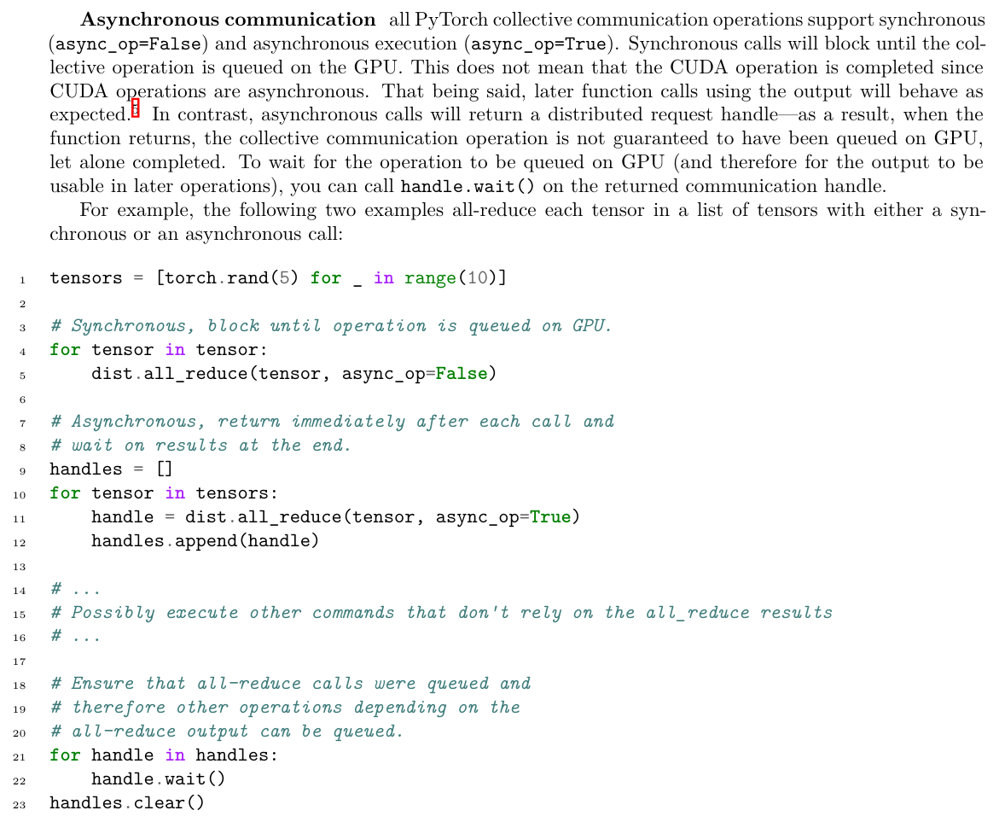
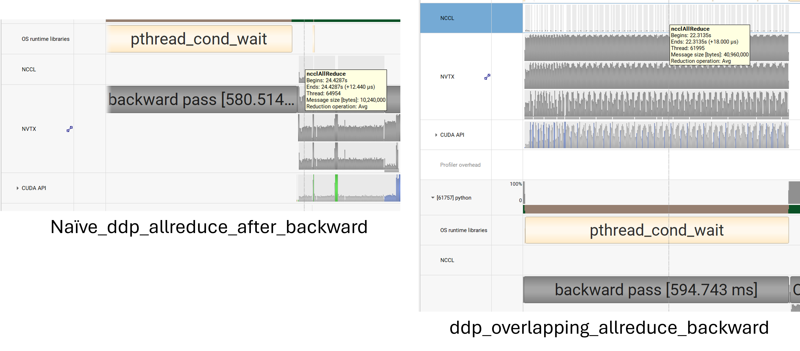

## 1.1.3 End-to-End Benchmarking
### Learnings
### Answers
1. see `cs336_systems/benchmarking_script.py` 
1. No significant deviation 
1. Without warmup the variation is significant. see `results/benchmark_results.jsonl` for full output

## 1.1.4 Nsight Systems Profiler
### Learnings
1. The versions of `nsys` need to match between Windows and Linux VM.
1. To install on Linux
    1. Download `.run` file from https://developer.nvidia.com/tools-downloads
    1. run and `export PATH=$PATH:$HOME/nsight-systems/bin`
1. `nvtx` is very helpful to isolate kernels for different parts of the calculation. To see operations by NVTX phase, 
    1. To get the report, run `nsys profile --python-backtrace=cuda --cudabacktrace=all --pytorch=autograd-nvtx python your_script.py --warmup --backward --mixed-precision` 
        1. `backtrace` for..., `autograd-nvtx` for...; both are optional if only time is needed.
    1. To see by `nvtx` section
        1. CLI: `nsys stats --report cuda_gpu_trace --format table --filter-nvtx "Forward Pass"  report.nsys-rep`
        1. UI: `apply filter` -> `Stats System View` in bottom dropdown -> `CUDA GPU trace`or whatever.
1. See `report-toy.nsys-rep` for simpler profiling.
### Answers
1. Yes, pretty close.
1. `ampere_sgemm` takes most GPU time during forward pass; it is invoked 9 times during a single forward pass. It also takes most GPU time when both forward/backward passes are considered.
1. `elementwise_kernel` with `MulFunctor`, both vectorized or not, accounts for ~10% GPU time. 
1. skipped
1. FLOPs wise, `matmul` is $O(qdk)$ while `softmax` is $O(qk)$, the variables are sizes of $Q$, $K$ and model dimension; former is way more FLOPs; runtime wise, they are quite comparable at 1ms.
1. https://youtu.be/aQ1NYoRvp7o

## 1.1.5 Mixed precision
### Learnings
1. Two sources of error. 
    1. The limited precision of binary machine representing decimal number
        ```python
        x = torch.tensor(0.01, dtype=torch.float32)
        print(f"0.01 in float32: {x.item():.10f}") 
        # 0.01 in float32: 0.0099999998 
        ```
    1. The accumulation. See how each accumulation gets rounded to nearest `float16/32` and ends up with different values.  Overall full precision is closer to exact value. Thus "a good idea to keep accumulations in higher precision even if the tensors themselves being accumulated have been downcasted" 
        ```python
        s1 = torch.tensor(0, dtype=torch.float16)
        s2 = torch.tensor(0, dtype=torch.float32)
        x = torch.tensor(0.01, dtype=torch.float16)
        print("float16, float32")
        for i in range(5):
            s1 += x
            s2 += x
            print(f"{s1.item():.10f}, {s2.item():.10f}")
        # float16, float32
        # 0.0100021362, 0.0100021362
        # 0.0200042725, 0.0200042725
        # 0.0299987793, 0.0300064087
        # 0.0400085449, 0.0400085449  # identical by accident
        # 0.0500183105, 0.0500106812
        ```
1. `torch.autocast`
    1. Data Type Flow in Mixed Precision
        - **Parameters**: float32 (for precision)
        - **Forward activations**: float16 (for speed) 
            ```python
            # What happens inside autocast:
            x = torch.randn(4, 3, dtype=torch.float32).cuda()  # Input: float32
            weight = torch.randn(10, 3, dtype=torch.float32).cuda()  # Param: float32

            # During matrix multiplication, autocast converts both to float16:
            # result = torch.matmul(x.half(), weight.half())  # Both converted to float16
            # So the output is float16
            ```
        - **Gradients**: float32 (for preventing underflow and numerical stability)
        - **Optimizer updates**: float32 (for precision)
    1. Where Speed Comes From
        - **GPU Tensor Cores**: 2-4x faster float16 matrix operations on modern GPUs
        - **Memory bandwidth**: Half the memory usage (2 bytes vs 4 bytes per element)
        - **Cache efficiency**: 2x more data fits in GPU cache
    1. Key Insights
        - Autocast converts float32→float16→float32 during operations
        - Conversion overhead is minimal compared to compute speedup
        - Gradients stay float32 to prevent underflow and maintain stability
        - Mixed precision = speed of float16 + stability of float32
1. Why Backward Pass Speeds Up Despite Being Outside Autocast
    1. **Stored Activations Are Lower Precision**: During forward pass with autocast, intermediate activations are stored in bfloat16. When backpropagation runs, these stored activations are loaded from memory using half the bandwidth.
    2. **Memory Bandwidth Benefits**: The reduced memory footprint of activations (2 bytes vs 4 bytes per element) means faster data movement during gradient computation.
    3. **Tensor Core Utilization**: Many gradient computation steps involve matrix operations with the stored bfloat16 activations, which can still leverage GPU Tensor Cores.
    4. **Cache Efficiency**: More activation data fits in GPU caches, reducing memory access latency during backprop.
1. `nullcontext` is useful for conditionally enabling/disabling other context managers
    ```python
    context = torch.autocast(device_type="cuda", dtype=torch.bfloat16) if use_mixed_precision else nullcontext()
    with context:
        ...
    ```

### Answers
#### mixed_precision_accumulation
1. As long as accumulation `s` is `float32`, the result is close. See [`Learnings`](#learnings-1) for more detail.
#### benchmarking_mixed_precision
1. data types
    - the model parameters within the autocast context: `float32`
    - the output of the first feed-forward layer (ToyModel.fc1): `float16`
    - the output of layer norm (ToyModel.ln): `float32`
    - the model's predicted logits: `float16`
    - the loss: `float32`
    - the model's gradients: `float32`
1. When `x` is large, `1/rms` in `float16` underflows, while `bfloat16` is fine. However, layer normalization is in `float32` in both cases. Why?
    ```python
    x = torch.tensor([1e3], dtype=torch.float16)
    rrms = torch.rsqrt(x.pow(2).mean(-1, keepdim=True))
    print(rrms)
    x = torch.tensor([1e3], dtype=torch.bfloat16)
    rrms = torch.rsqrt(x.pow(2).mean(-1, keepdim=True))
    print(rrms)
    # tensor([0.], dtype=torch.float16)
    # tensor([0.0010], dtype=torch.bfloat16)
    ```
1. Run benchmarking [script](./cs336_systems/benchmarking.sh) and get result. 
    ```csv
    size,precision,forward_runs,forward_time_seconds,backward_runs,backward_time_seconds
    small,full,10,0.317784,10,0.733286
    small,mixed,10,0.486204,10,0.918253
    medium,full,10,0.655829,10,1.690529
    medium,mixed,10,0.962006,10,1.769694
    large,full,10,0.948486,10,4.092338
    large,mixed,10,1.330271,10,2.244423
    xl,full,10,1.766273,10,8.497722
    xl,mixed,10,1.509672,10,3.65094
    2.7b,full,10,1.837926,10,13.481286
    2.7b,mixed,10,0.932135,10,4.093555
    ```
    1. Only when model is big enough do the `mixed-precision` show benefits.
    1. Forward wise, `2.7b-mixed` is faster than `xl-mixed`. Why?
1. 

## 1.1.6 Profiling Memory
### Learnings
1. Understand `active Memory Timeline`
    1. Each entry is to be understand as the resultant *tensor* of some operation. Each has a start and an end (releases memory)
        1. E.g., `output = self.lm_head(attn_output)` the memory of `output` should be `batch_size * seq_len * vocab_size * 4 bytes`.
    1. Memories that persist are probably model weights? But why did it not change with `context_length`?
    1. To start, blow up `memory_256_forward.pickle` and see each entry. You can see the shape of the blocks and details within.
1. Observations of the memory plot
    1. zoom in to see the multiple `stairs` of memory, each corresponds to one Transformer block.
    1. `ffn` requires a lot of memory comparing to `attn`
### Answers
#### memory_profiling
1. See the `memory_*pickle` files. 
1. Table with full precision.
    | Context Length | Forward | Full |
    |:--------------:|:--------------:|:-----------:|
    | 128 | 19.3GB | 60.0GB |
    | 256 | 26.0GB | 67.0GB |
    | 512 | 42.8GB | - |
1. Table with mixed precision. The memory profile with mixed precision looked more fragmented. Why?
    | Context Length | Forward | Full |
    |:--------------:|:--------------:|:-----------:|
    | 128 | 24.0GB | 65.0GB |
    | 256 | 28.3GB | 69.0GB |
    | 512 | 39.6GB | - |
1. 5, 10, 20 MBs for context lengths 128, 256, 512 respectively.
    1. Corresponding line: `cs336_basics/model.py:385:forward`, which is `ffn_sublayer_output = attn_sublayer_output + x_ffn`.
    1. 4 seqs/batch x 128 toks/seq x 2560 floats/tok x 4 bytes/float = 5 MB
1. The largest allocations are those corresponds to `FFN`.


## 1.2.1 Benchmarking PyTorch Attention
### Learnings
### Ansers
#### pytorch_attention
1. Timing 100 forward/backward. 
    |    |   d_model |   seq_len |   batch_size | backward   |   forward_time |   backward_time |   total_time | status   |
    |---:|----------:|----------:|-------------:|:-----------|---------------:|----------------:|-------------:|:---------|
    |  0 |        16 |       256 |            8 | True       |         0.1012 |          0.1371 |       0.2383 | success  |
    |  1 |        16 |      1024 |            8 | True       |         0.2941 |          0.4229 |       0.7171 | success  |
    |  2 |        16 |      4096 |            8 | True       |         1.5719 |          1.5144 |       3.0863 | success  |
    |  3 |        16 |      8192 |            8 | True       |         4.4004 |          2.9757 |       7.3761 | success  |
    |  4 |        16 |     16384 |            8 | True       |        13.9563 |          5.8925 |      19.8488 | success  |
    |  5 |        32 |       256 |            8 | True       |         0.101  |          0.1372 |       0.2382 | success  |
    |  6 |        32 |      1024 |            8 | True       |         0.3067 |          0.427  |       0.7337 | success  |
    |  7 |        32 |      4096 |            8 | True       |         1.641  |          1.5514 |       3.1924 | success  |
    |  8 |        32 |      8192 |            8 | True       |         4.5796 |          2.958  |       7.5375 | success  |
    |  9 |        32 |     16384 |            8 | True       |        14.4986 |          5.8994 |      20.398  | success  |
    | 10 |        64 |       256 |            8 | True       |         0.1123 |          0.1452 |       0.2575 | success  |
    | 11 |        64 |      1024 |            8 | True       |         0.3375 |          0.441  |       0.7784 | success  |
    | 12 |        64 |      4096 |            8 | True       |         1.8024 |          1.6438 |       3.4462 | success  |
    | 13 |        64 |      8192 |            8 | True       |         4.9855 |          3.2003 |       8.1858 | success  |
    | 14 |        64 |     16384 |            8 | True       |        15.6728 |          6.3461 |      22.0189 | success  |
    | 15 |       128 |       256 |            8 | True       |         0.1377 |          0.1716 |       0.3093 | success  |
    | 16 |       128 |      1024 |            8 | True       |         0.404  |          0.518  |       0.922  | success  |
    | 17 |       128 |      4096 |            8 | True       |         2.1052 |          1.8568 |       3.9619 | success  |
    | 18 |       128 |      8192 |            8 | True       |         5.7687 |          3.6539 |       9.4226 | success  |
    | 19 |       128 |     16384 |            8 | True       |        17.9237 |          7.2563 |      25.1799 | success  |
1. Run `pytorch pytorch_attention.py --memory-profiling --train-steps 1 --d-model 128 --seq-len 16384 --backward --compile --memory-profile-name something.pickle` to get the memory profile.
    1. the `attention_scores` requires big chunk of memory, up to 8GB, when `seq-len` is big; long sequence is the bottleneck.
    1. the memory saved for backward seems to be linear with sequence length.

## 1.3 Benchmarking JIT-Compiled Attention
### Learnings
### Ansers
#### torch_compile
1. Timing 100 forward/backward (JIT-compiled) 
    |    |   d_model |   seq_len |   batch_size | backward   |   forward_time |   backward_time |   total_time | status   |
    |---:|----------:|----------:|-------------:|:-----------|---------------:|----------------:|-------------:|:---------|
    |  0 |        16 |       256 |            8 | True       |         0.0906 |          0.1542 |       0.2448 | success  |
    |  1 |        16 |      1024 |            8 | True       |         0.268  |          0.4256 |       0.6936 | success  |
    |  2 |        16 |      4096 |            8 | True       |         1.2183 |          1.5116 |       2.7298 | success  |
    |  3 |        16 |      8192 |            8 | True       |         2.9427 |          2.9663 |       5.909  | success  |
    |  4 |        16 |     16384 |            8 | True       |         8.3247 |          5.8856 |      14.2103 | success  |
    |  5 |        32 |       256 |            8 | True       |         0.0918 |          0.1418 |       0.2336 | success  |
    |  6 |        32 |      1024 |            8 | True       |         0.2829 |          0.4234 |       0.7063 | success  |
    |  7 |        32 |      4096 |            8 | True       |         1.288  |          1.5435 |       2.8315 | success  |
    |  8 |        32 |      8192 |            8 | True       |         3.1297 |          2.969  |       6.0986 | success  |
    |  9 |        32 |     16384 |            8 | True       |         8.8675 |          5.8897 |      14.7572 | success  |
    | 10 |        64 |       256 |            8 | True       |         0.1018 |          0.1574 |       0.2592 | success  |
    | 11 |        64 |      1024 |            8 | True       |         0.3139 |          0.4535 |       0.7675 | success  |
    | 12 |        64 |      4096 |            8 | True       |         1.4416 |          1.6397 |       3.0813 | success  |
    | 13 |        64 |      8192 |            8 | True       |         3.536  |          3.1987 |       6.7347 | success  |
    | 14 |        64 |     16384 |            8 | True       |        10.0435 |          6.3318 |      16.3753 | success  |
    | 15 |       128 |       256 |            8 | True       |         0.1142 |          0.1687 |       0.2829 | success  |
    | 16 |       128 |      1024 |            8 | True       |         0.3769 |          0.5186 |       0.8955 | success  |
    | 17 |       128 |      4096 |            8 | True       |         1.7529 |          1.8669 |       3.6198 | success  |
    | 18 |       128 |      8192 |            8 | True       |         4.3211 |          3.6537 |       7.9748 | success  |
    | 19 |       128 |     16384 |            8 | True       |        12.295  |          7.2433 |      19.5383 | success  |
    1. Comparing to non-compiled table, the improvement is in `forward_time`.
    1. with longer context length, the advantage of compilation is more obvious.
1. E2E timings
    |    |   num_steps | compile   |   d_model |   d_off |   num_layers |   num_heads |   forward_mean |   forward_std |   backward_mean |   backward_std |
    |---:|------------:|:----------|----------:|--------:|-------------:|------------:|---------------:|--------------:|----------------:|---------------:|
    |  0 |          10 | False     |       768 |    3072 |           12 |          12 |         0.0256 |        0.0008 |          0.0557 |         0.0005 |
    |  1 |          10 | True      |       768 |    3072 |           12 |          12 |         0.0183 |        0.0001 |          0.0498 |         0.0004 |
    |  2 |          10 | False     |      1024 |    4096 |           24 |          16 |         0.0672 |        0.0005 |          0.1702 |         0.0003 |
    |  3 |          10 | True      |      1024 |    4096 |           24 |          16 |         0.0563 |        0.0002 |          0.1549 |         0.0004 |
    |  4 |          10 | False     |      1280 |    5120 |           36 |          20 |         0.1438 |        0.0008 |          0.3756 |         0.0005 |
    |  5 |          10 | True      |      1280 |    5120 |           36 |          20 |         0.1256 |        0.0003 |          0.3474 |         0.0003 |
    |  6 |          10 | False     |      1600 |    6400 |           48 |          25 |         0.2827 |        0.0004 |          0.7676 |         0.001  |
    |  7 |          10 | True      |      1600 |    6400 |           48 |          25 |         0.2551 |        0.0002 |          0.7201 |         0.0006 |
    |  8 |          10 | False     |      2560 |   10240 |           32 |          32 |         0.4174 |        0.0004 |          1.1791 |         0.0007 |
    |  9 |          10 | True      |      2560 |   10240 |           32 |          32 |         0.393  |        0.0001 |          1.1333 |         0.0004 |
    1. less improvement when e2e.


1. `torch` should automatically take care of the precision basing on input precision
1. `triton`
    1. on chip buffers ($O_i$, l, m) should be `tl.float32` and use `acc` with `tl.dot`.
    1. map output to input precision when storing back to memory
1. `triton.autotune`
1. peak memory? why not much memory difference?
1. From a performance perspective, compiling the backward recomputation either (A) inside the module (compile the recompute function and call it from the autograd backward) or (B) by compiling the wrapper that calls your autograd Function (e.g. `torch.compile(FlashAttention2(...))`) will yield very similar runtime performance after the first call.
1. `tensor.contiguous()` is crucial! Without it I keep running into "illegal memory access" when doing `backward` with Triton.
    1. E.g., `dO_2d = rearrange(dO, "b q d -> (b q) d").contiguous()` coz `dO` might not be contiguous coming from backprop.
    1. Always test WITHOUT `torch.compile` on `impl.apply`-- sometimes non-contiguous problem got covered up.
1. Things I did to get `FlashAttentionTritonOptimized`
    1. skipping zero masks helped a lot; when `is_causal=False` the test is much slower
    1. `triton` for both forward/backward passes
    1. `triton.autotune` helps


1. Issues with Algorithm 2:
    1. dQ loading issue: You're correct - the algorithm shows "Load Q_i, O_i, dO_i, dQ_i from global memory" but dQ hasn't been initialized yet. This appears to be an error in the algorithm description.
    1. P computed twice: The algorithm doesn't explicitly show P being computed twice. The text mentions computing P twice (once for dQ, once for dK/dV), but the algorithm as written seems to compute everything in one pass.
    1. Why is this not a problem with forward pass?
1. Corrected Algorithm 2: Tiled FlashAttention-2 backward pass
    ```
    Input: Q, O, dO ∈ R^(N_q×d), K, V ∈ R^(N_k×d), L ∈ R^(N_q), tile sizes B_q, B_k
    Compute D = rowsum(dO ⊙ O) ∈ R^(N_q)
    Split Q, O, dO into T_q = ⌈N_q/B_q⌉ tiles Q_1,...,Q_Tq, O_1,...,O_Tq, dO_1,...,dO_Tq, each of size B_q × d
    Split K, V into T_k = ⌈N_k/B_k⌉ tiles K^(1),...,K^(Tk) and V^(1),...,V^(Tk), each of size B_k × d
    Split L, D into T_q tiles L_1,...,L_Tq and D_1,...,D_Tq, each of size B_q

    Initialize dQ, dK, dV to zeros in global memory

    # Option 1: Single pass with atomics (what Algorithm 2 seems to suggest)
    for j = 1,...,T_k do
        Load K^(j), V^(j) from global memory
        Initialize dK^(j) = dV^(j) = 0 ∈ R^(B_k×d) in SRAM
        
        for i = 1,...,T_q do
            Load Q_i, O_i, dO_i from global memory
            Load L_i, D_i from global memory
            
            # Recompute attention scores for this tile
            Compute tile of attention scores S_i^(j) = (Q_i(K^(j))^T) / √d ∈ R^(B_q×B_k)
            
            # Recompute attention probabilities (avoiding softmax)
            Compute attention probabilities P_i^(j) = exp(S_i^(j) - L_i) ∈ R^(B_q×B_k)
            
            # Compute gradients
            Compute dV^(j) += (P_i^(j))^T dO_i ∈ R^(B_k×d)
            Compute dP_i^(j) = dO_i V_j^T ∈ R^(B_q×B_k)
            Compute dS_i^(j) = P_i^(j) ⊙ (dP_i^(j) - D_i) / √d ∈ R^(B_q×B_k)
            
            # Accumulate dQ (requires atomic add since multiple j's write to same dQ_i)
            Load dQ_i from global memory (or initialize to 0 on first j)
            Compute dQ_i += dS_i^(j) K^(j) ∈ R^(B_q×d)
            Store dQ_i back to global memory with atomic add
            
            # Accumulate dK for this j
            Compute dK^(j) += (dS_i^(j))^T Q_i ∈ R^(B_k×d)
        end for
        
        Write dK^(j) and dV^(j) to global memory as the j-th tiles of dK and dV
    end for

    Return dQ, dK, dV

    # Option 2: Two passes (more practical, avoids atomics)

    Pass 1: Compute dQ
    Initialize dQ = 0 in global memory
    for i = 1,...,T_q do
        Load Q_i, O_i, dO_i, L_i, D_i from global memory
        Initialize dQ_i = 0 in SRAM
        
        for j = 1,...,T_k do
            Load K^(j), V^(j) from global memory
            Compute S_i^(j) = (Q_i(K^(j))^T) / √d
            Compute P_i^(j) = exp(S_i^(j) - L_i)
            Compute dP_i^(j) = dO_i V_j^T
            Compute dS_i^(j) = P_i^(j) ⊙ (dP_i^(j) - D_i) / √d
            Accumulate dQ_i += dS_i^(j) K^(j)
        end for
        
        Write dQ_i to global memory
    end for

    Pass 2: Compute dK and dV
    for j = 1,...,T_k do
        Load K^(j), V^(j) from global memory
        Initialize dK^(j) = dV^(j) = 0 in SRAM
        
        for i = 1,...,T_q do
            Load Q_i, O_i, dO_i, L_i, D_i from global memory
            Compute S_i^(j) = (Q_i(K^(j))^T) / √d
            Compute P_i^(j) = exp(S_i^(j) - L_i)
            Accumulate dV^(j) += (P_i^(j))^T dO_i
            Compute dP_i^(j) = dO_i V_j^T
            Compute dS_i^(j) = P_i^(j) ⊙ (dP_i^(j) - D_i) / √d
            Accumulate dK^(j) += (dS_i^(j))^T Q_i
        end for
        
        Write dK^(j) and dV^(j) to global memory
    end for
    ```

# FlashAttention-2 Backward Pass: Algorithm Clarification and Atomic Operations

## Algorithm 2 Issues and Corrections

### The Problem with Algorithm 2 as Written
1. **Uninitialized dQ Loading**: The algorithm shows "Load Q_i, O_i, dO_i, dQ_i from global memory" but dQ hasn't been initialized yet. This is an error - dQ should either be initialized to zeros or the algorithm should clarify it's accumulating.

2. **Unclear about "Computing P Twice"**: The text mentions computing P twice (once for dQ, once for dK/dV) but the algorithm doesn't clearly show this separation.

3. **Race Condition**: The single-pass approach has multiple thread blocks trying to update the same dQ tiles, creating a race condition.

## The Atomic Operations Challenge

### Why Atomics are Needed in Single-Pass
In the single-pass version of Algorithm 2:
- **Outer loop**: Iterates over K/V tiles (j = 1 to T_k)  
- **Inner loop**: Iterates over Q tiles (i = 1 to T_q)
- **Problem**: Every K/V tile (different j values) needs to update ALL Q tiles

Example with 4 tiles:
- j=1 (K tile 1): Updates dQ_1, dQ_2, dQ_3, dQ_4
- j=2 (K tile 2): Also updates dQ_1, dQ_2, dQ_3, dQ_4  
- j=3 (K tile 3): Also updates dQ_1, dQ_2, dQ_3, dQ_4
- Result: Race condition - multiple thread blocks writing to same memory

### Why Atomics Kill Performance
1. **Serialization**: Atomic operations force sequential access to memory locations
2. **Memory bottleneck**: GPUs are designed for parallel memory access; atomics break this
3. **Contention**: More thread blocks competing for same memory = more waiting

## The Two-Pass Solution (Recommended)

### Pass 1: Compute dQ
- Each thread block handles ONE Q tile across ALL K tiles
- Thread block i computes complete dQ_i by iterating through all j
- **No atomics needed**: Only one block writes to each dQ_i

### Pass 2: Compute dK and dV  
- Each thread block handles ONE K/V tile across ALL Q tiles
- Thread block j computes complete dK_j, dV_j by iterating through all i
- **No atomics needed**: Only one block writes to each dK_j, dV_j

### Benefits of Two-Pass Approach
1. **No synchronization overhead**: Each memory location written by exactly one thread block
2. **Better memory access patterns**: Coalesced reads/writes without contention
3. **Simpler implementation**: No need for atomic operations or complex synchronization
4. **Better performance**: Typically much faster than atomic-based single pass

## Key Insight
The "compute P twice" mentioned in the text refers to recomputing P in both passes:
- Once when computing dQ (Pass 1)
- Once when computing dK/dV (Pass 2)

This recomputation is worth it because:
1. Avoids storing large P matrix (would require O(N²) memory)
2. Eliminates atomic operations (massive performance win)
3. P computation is fast compared to atomic serialization overhead

----

# Triton Autotune Parameters: num_stages and num_warps

## Overview
`num_stages` and `num_warps` are important performance tuning parameters in Triton that control how the GPU executes your kernel.

## num_warps
**What it is**: The number of warps (groups of 32 threads) per thread block

**Range**: Typically 1, 2, 4, or 8 warps (32, 64, 128, or 256 threads per block)

**Trade-offs**:
- **More warps**: Better latency hiding, more parallelism within a block
- **Fewer warps**: More registers/shared memory per thread, potentially better for compute-heavy kernels

**Example**: `num_warps=4` means 128 threads per block

## num_stages
**What it is**: The number of pipeline stages for software pipelining

**Purpose**: Overlaps memory loads with computation to hide memory latency

**How it works**:
- Stage 1: Load data from global memory
- Stage 2: Compute on previously loaded data while loading next data
- Stage 3+: Continue overlapping loads and computes

**Trade-offs**:
- **More stages**: Better memory latency hiding, higher throughput
- **Fewer stages**: Less shared memory usage, simpler scheduling

**Typical values**: 1-5 stages

## Example Configuration
```python
triton.Config({'Q_TILE_SIZE': 128, 'K_TILE_SIZE': 128}, num_stages=4, num_warps=8)
```

## 2.1.1 Best Practices for Benchmarking Distributed Applications
### Learnings
1. Should use same data for warmup. Why?
    1. Different tensor sizes trigger different code paths: GPU kernels, memory allocation patterns, and NCCL's internal algorithms can vary significantly based on tensor size. Warming up with a 1MB tensor won't properly warm up the cache, memory allocators, or kernel configurations for a 100MB tensor.
    2. Memory allocation effects: The first time you allocate and use a large tensor, PyTorch/CUDA might need to allocate memory pools, which adds overhead. If you warmup with small tensors, this overhead will still hit your benchmark.
    3. NCCL algorithm selection: NCCL often selects different communication algorithms based on message size (ring, tree, etc.). Warming up with the wrong size won't prepare the right algorithm.
1. Synchronization in comminucation
    1. `async_op=False` is equivalent to `wait` func, blocking till all comminucation operations is queued. 
    1. Call `torch.cuda.synchronize()` to wait for CUDA operations to complete when benchmarking on GPUs. Note that this is necessary even when calling communication operations with `async_op=False`, which returns when the operation is queued on the GPU (as opposed to when the communication actually finishes). For more detail see [here](https://github.com/pytorch/pytorch/issues/68112#issuecomment-965932386) and [here](https://docs.pytorch.org/docs/stable/distributed.html#synchronous-and-asynchronous-collective-operations)
    1. [link](https://docs.pytorch.org/docs/stable/notes/cuda.html#cuda-streams) to supscript.
    1. collective operations act as an implicit synchronization point - all ranks must participate and wait for each other during the operation itself. Like an implicit `dist.barrier()`.
1. `hook` function
    1. on tensor
        1. `leaf node`: is not calculated by any other nodes that requires gradient.
    1. functions of an `autograd.function` object, e.g., `AddBackward`.
### Ansers
#### distributed_commnucation_single_node
1. Timing
    ```
    gloo, 1MB, world_size=2: 0.01876
    gloo, 10MB, world_size=2: 0.02016
    gloo, 100MB, world_size=2: 0.02439
    gloo, 1024MB, world_size=2: 0.06172
    nccl, 1MB, world_size=2: 0.00284
    nccl, 10MB, world_size=2: 0.00284
    nccl, 100MB, world_size=2: 0.00286
    nccl, 1024MB, world_size=2: 0.00308
    ```
1. observation
    - the time with `nccl` hardly increased with tensor size. I think this is because of large number of kernels and highly optimized communication in `dist`.
#### naive_ddp_benchmarking
1. Two sets of `time.time()`, one for total time and the other just for communication. Needs to pay extra attention to the use of `dist.barrier()`. See discussion in script.
1. Durations. Interesting how communication time is different while total time is similar. It's unlikely that two GPUs take very different time for forward/backward passes. So implicit waiting between ranks?
    ```
    Rank 1: Total time 1.05300, Comm time 0.01147 
    Rank 0: Total time 1.05300, Comm time 0.05212 
    ```
#### minimal_ddp_flat_benchmarking
1. Durations. The comm time is shorter with batched communication as expected.
    ```
    Rank 1: Total time 1.04605, Comm time 0.00218 
    Rank 0: Total time 1.04608, Comm time 0.04185
    ```
#### ddp_overlap_individual_parameters_benchmarking
1. `register_post_accumulate_grad_hook` only works with leaf tensor. Luckily all parameters are leaves, unlike activations.
1. Good use of `__get_attr__` to inherit attributes from the wrapped module.
1. Durations. The total time is not 
    ```
    Rank 1: Total time 1.03150
    Rank 0: Total time 1.03149
    ```
1. Nsys comparison. 


